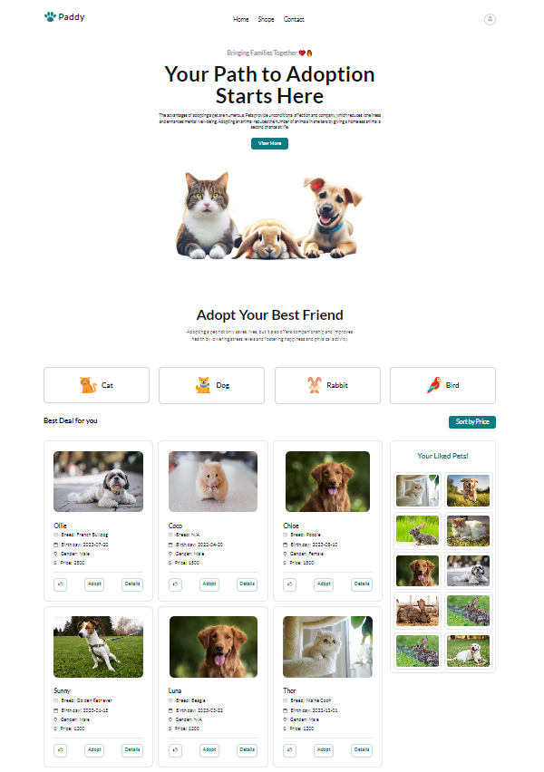
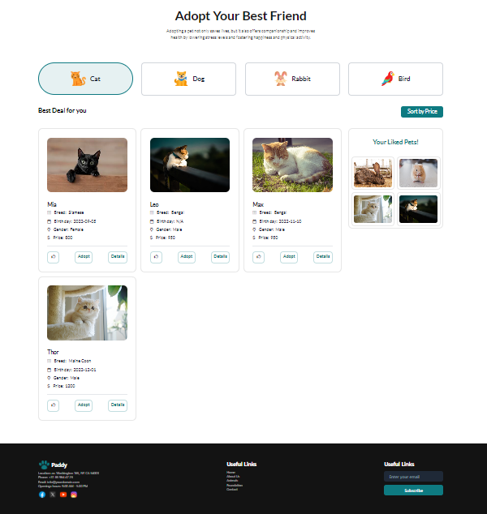
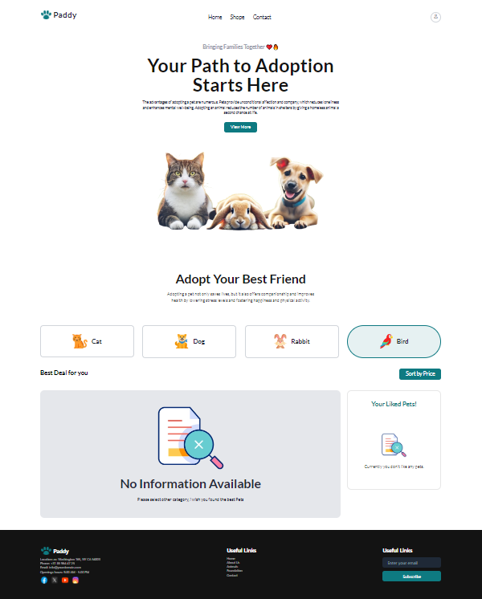
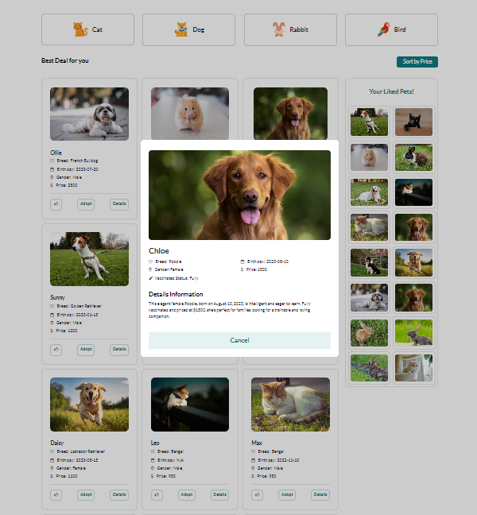

# Project Name: Paddy (Pet adoption web application).

## Short Description:

This is a pet adoption website, by visiting you can see different types of pets, you can choose your pet for adoption, and you can also see the details of every pet like name, age, breed, price, and detailed information about the pet.

## Key Features

1. **Show pets by category.**
2. **Sort by price.**
3. **The like button to add the pet photo to the favorite list**
4. **The adoption button, and show a popup notification.**
5. **The details button shows every detail about pets.**

## ES6 Features Used

- **Arrow Functions**
- **Template Literals**
- **Promises**

## Live Link

[Paddy the pets adoption web application](https://mz-pat-shop.surge.sh/).

### Preview

